[](http://stable.melpa.org/#/creamsody-theme) [](http://melpa.org/#/creamsody-theme)

# Creamsody

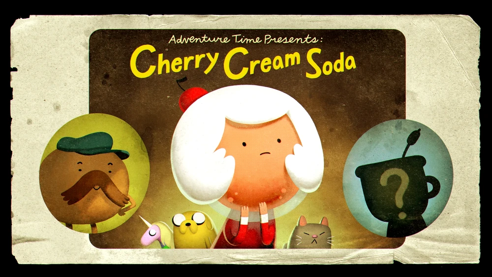

A color theme for Emacs.  Straight from the soda fountain.

## Autothemer

Creamsody uses autothemer which dramatically improves coding comfort when writing themes for Emacs.

If you're making Emacs themes, get it.

## Installation

Creamsody is easily installed via MELPA.  [Read more here for MELPA setup details](http://melpa.org/#/getting-started)

When your Emacs is setup to use MELPA do this:

```
M-x package-install creamsody-theme
```

Creamsody now comes in 3 variations, the original theme is still called `creamsody` and there are 2 
darker/higher contrast versions, `creamsody-dark` and `creamsody-darker`.

We'll need to tell Emacs that the themes are safe, so we'll load them and respond to the Emacs prompts.

For creamsody:

```
M-x load-theme creamsody
```

For creamsody-dark:

```
M-x load-theme creamsody-dark
```

For creamsody-darker:

```
M-x load-theme creamsody-darker
```

## Screenshots

# Original theme - creamsody

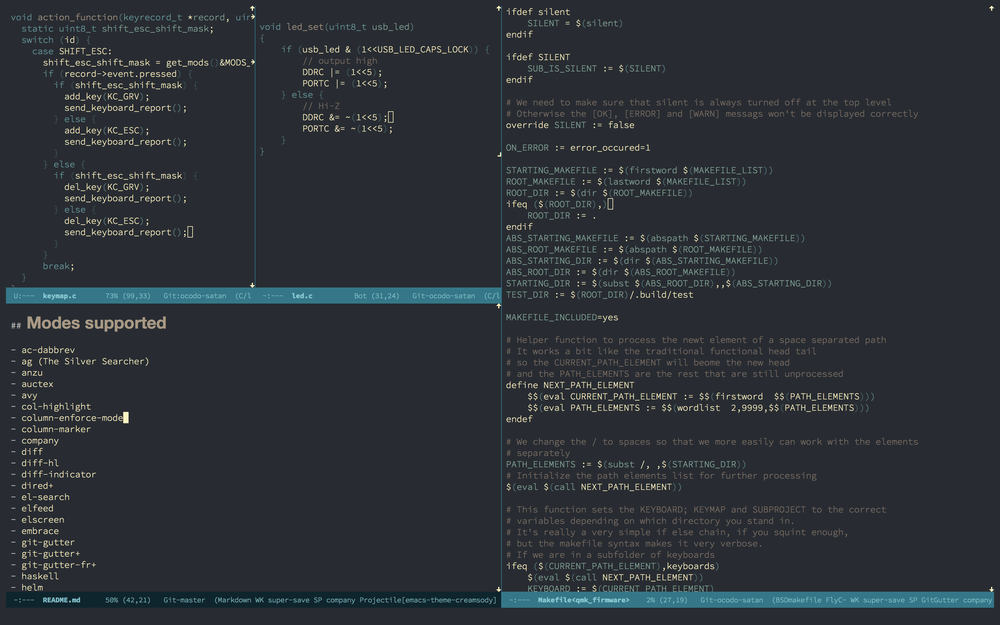


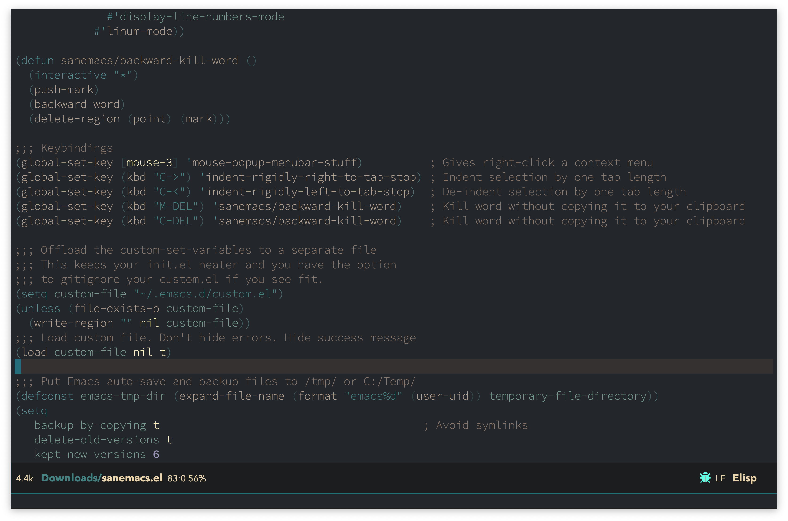

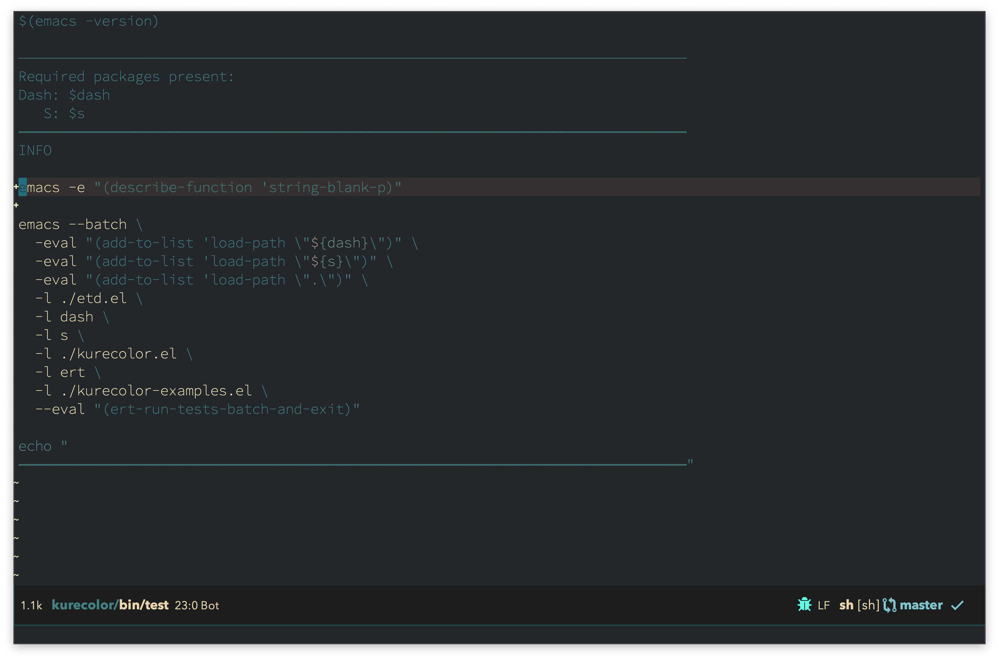

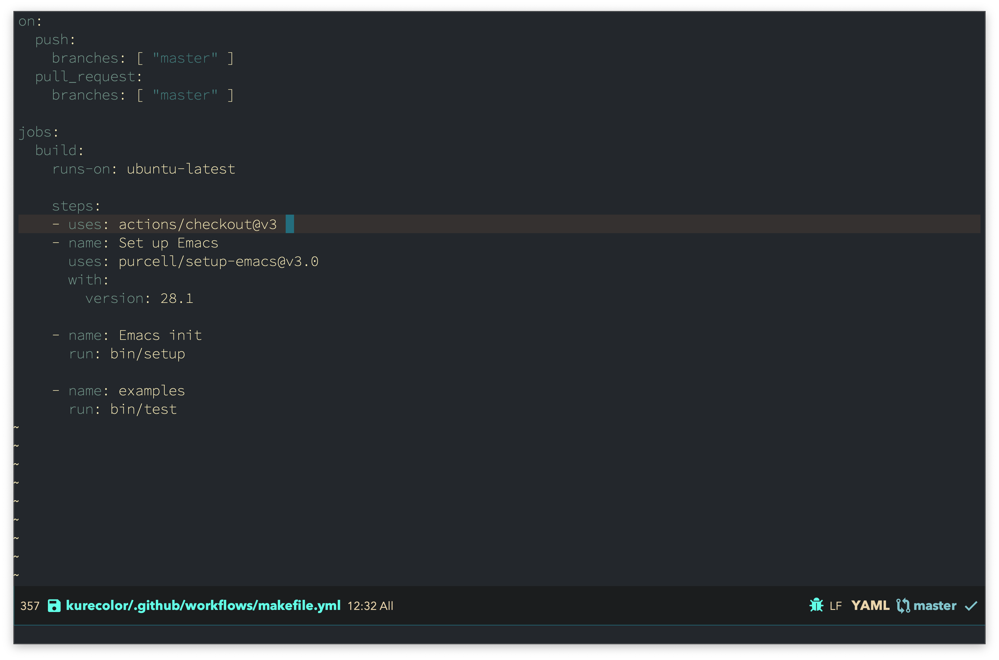

# Dark theme - creamsody-dark

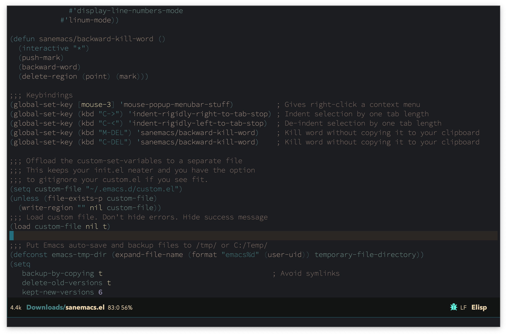

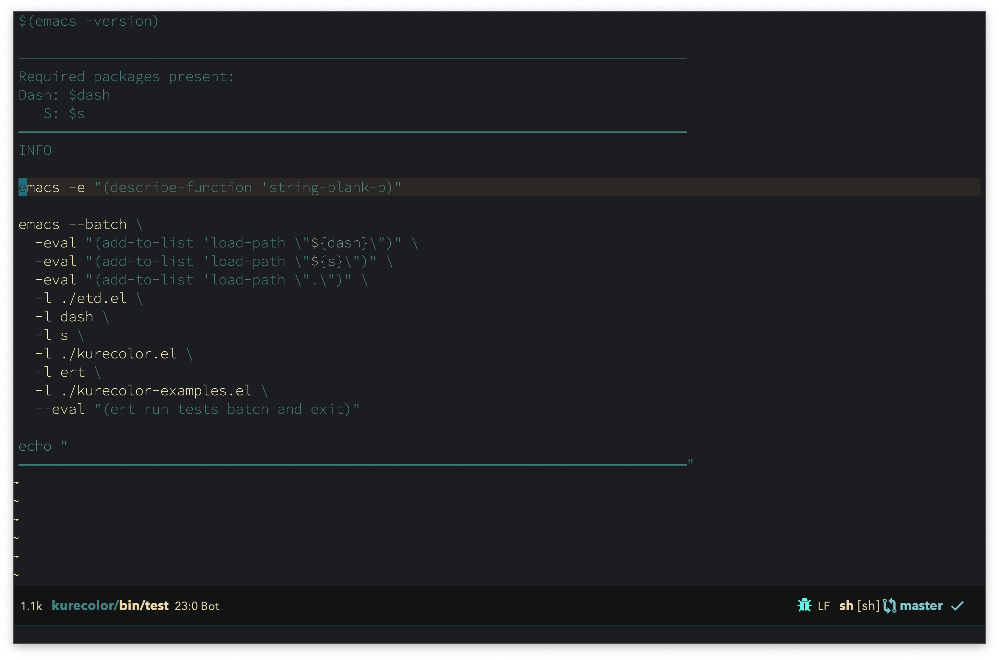

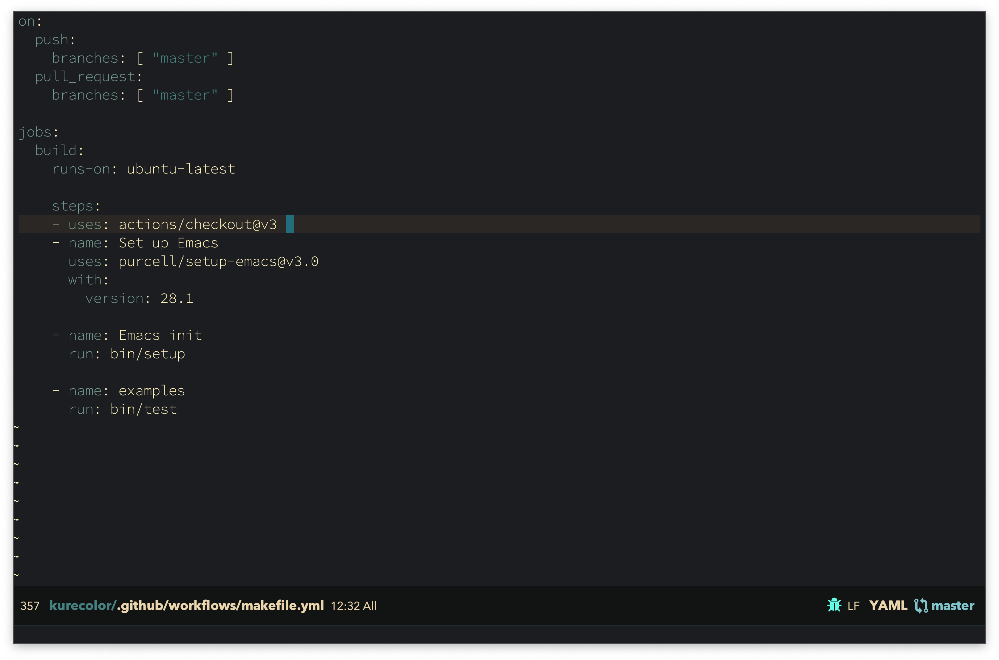

# Darker theme - creamsody-darker

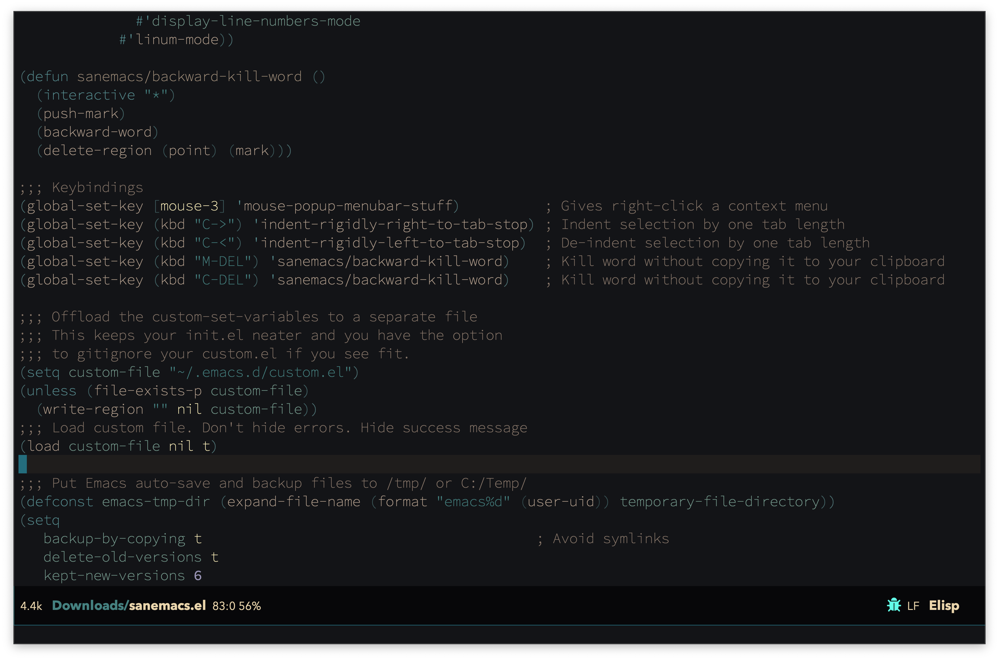

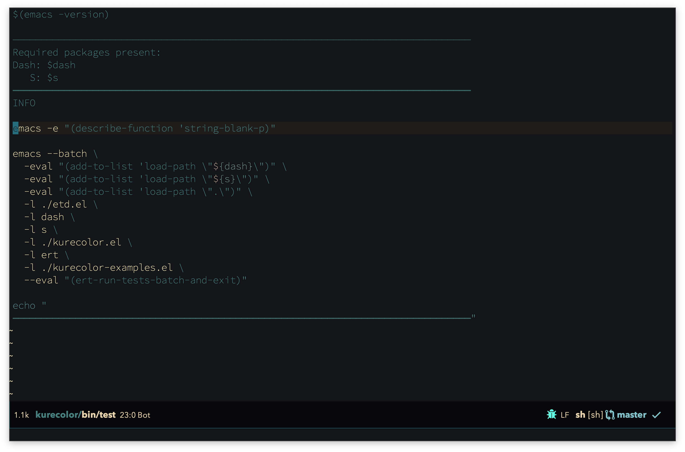

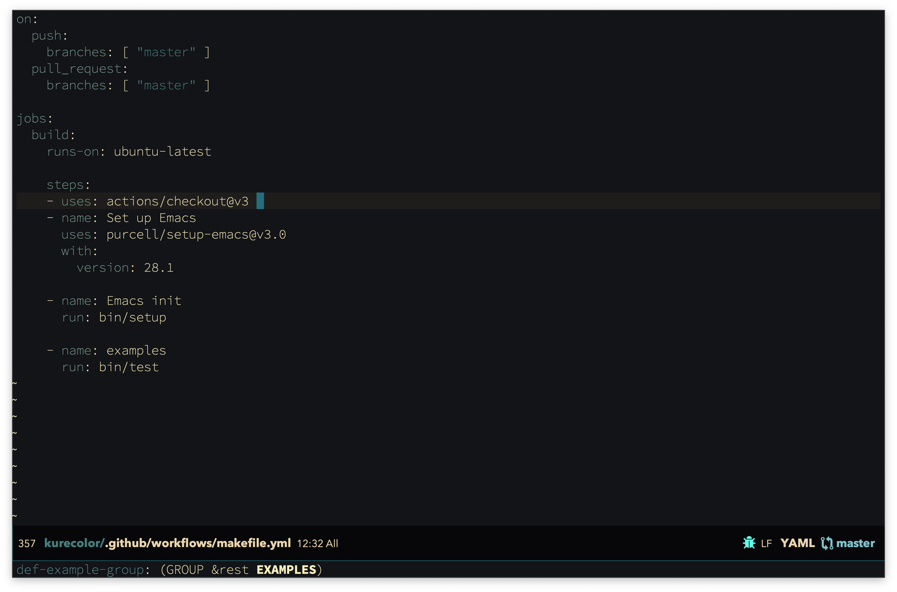

### Creamsody Mode line

There's a set of optional modeline themes available, run `(creamsody-modeline)` for the default. `(creamsody-modeline-one)`: 

**Creamsody modeline one - screenshot**


**Creamsody modeline two - screenshot**

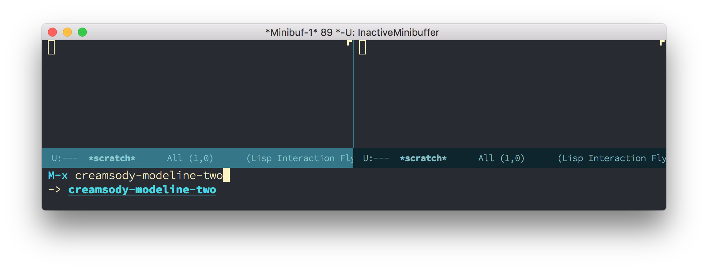

**Creamsody modeline three - screenshot**

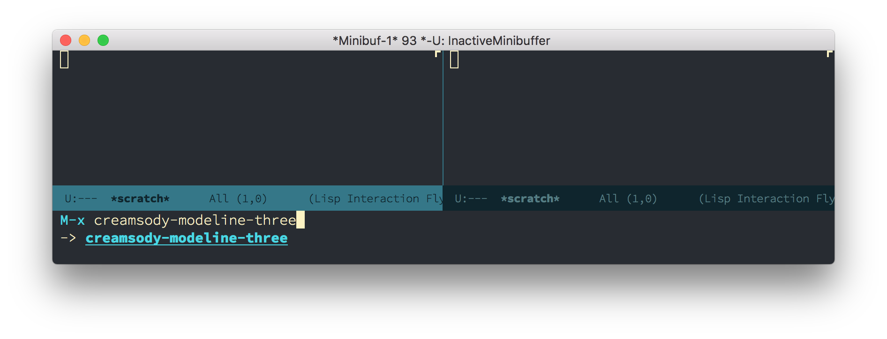

**Creamsody modeline four - screenshot**


## Modes supported

- ac-dabbrev
- ag (The Silver Searcher)
- anzu
- auctex
- avy
- col-highlight
- column-enforce-mode
- column-marker
- company
- diff
- diff-hl
- diff-indicator
- dired+
- dired-subtre
- el-search
- elfeed
- elscreen
- embrace
- git-gutter
- git-gutter+
- git-gutter-fr+
- haskell
- helm
- hi-lock
- highlight-indentation-mode
- highlight-numbers
- highlight-symbol
- hydra
- ido
- isearch
- ivy
- linum-relative
- magit
- message
- org-mode
- popup
- powerline
- rainbow-delimiters
- rainbow-identifiers
- ripgrep
- sh mode
- show-paren
- smart-mode-line
- smartparens
- smerge
- term / ansi-colors
- vline
- window-divider-mode
- whitespace-mode

### Screenshots

### Forked from Darktooth

It's the Creamy Sodarey fork of Darktooth, inspired by the syntax.css I made
for https://emacsgifs.github.io

##### Credit

Cherry Cream Soda is a character from Adventure Time.  I have no right
to use her like this.  For the love of Gob!  Stop me!
